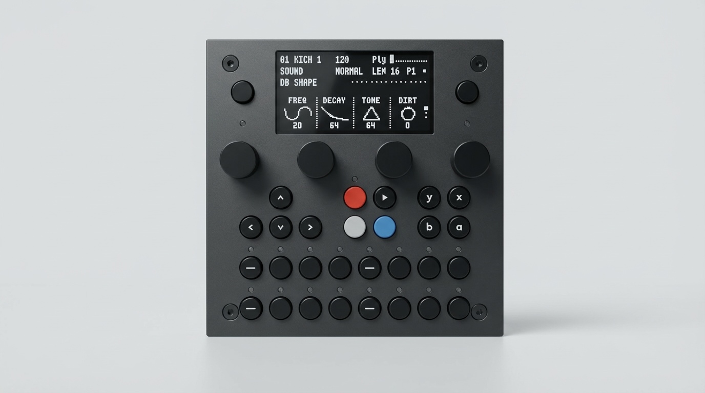

Hardware
========

The **TBD-16** is a standalone desktop audio DSP instrument --- a premium devkit
and a complete instrument in one box.

.. list-table::
   :widths: 30 70

   * - **Processors**
     - ESP32-P4 (DSP) · RP2350 (UI/MIDI) · ESP32-C6 (WiFi)
   * - **Audio Codec**
     - `TLV320AIC3254 <https://www.ti.com/product/en-us/TLV320AIC3254/part-details/TLV320AIC3254IRHBR>`_ --- Stereo ADC/DAC
   * - **Interface**
     - 30 buttons · 4 endless pots · 2.4" OLED · 19 RGB LEDs
   * - **Audio**
     - Stereo in · stereo out · headphone out (all TRS 3.5 mm) · 44.1 kHz / 32-bit float
   * - **MIDI**
     - 2× TRS In (Type-A, In 2 doubles as Clock/Reset) · 2× TRS Out · USB MIDI · USB Host MIDI
   * - **USB**
     - 3× USB-C (P4 Device · Power/RP2350 · JTAG) · 1× USB-A Host
   * - **Plugins**
     - 50+ synths, effects, drum machines in one firmware

:doc:`Full TBD-16 specs → <10_tbd16>`

.. raw:: html

   

     <a href="https://dadamachines.com/shop/" style="padding:0.6em 1.5em; background:var(--color-brand-primary, #6a5acd); color:#fff; border-radius:6px; text-decoration:none; font-weight:600;">Buy TBD-16</a>
     <a href="https://dadamachines.com" style="padding:0.6em 1.5em; border:1px solid var(--color-background-border, #ccc); border-radius:6px; text-decoration:none; font-weight:500;">dadamachines.com</a>
   

----

Platform Options
----------------

The TBD platform is modular. Beyond the TBD-16, dadamachines offers two
additional paths for instrument designers and manufacturers:

.. list-table::
   :header-rows: 1
   :widths: 25 40 35

   * - Product
     - What It Is
     - For Whom
   * - :doc:`TBD-Core <20_tbd_core>`
     - Core DSP board with all I/O assembled + 30-pin FFC for custom UI
     - Instrument designers, product developers
   * - :doc:`Custom Integration <30_custom_integration>`
     - ESP32-P4 + RP2350 + Codec on your own PCB (custom codec options available)
     - Manufacturers, OEMs, collaborators

Which Tier Is Right for You?
^^^^^^^^^^^^^^^^^^^^^^^^^^^^

.. list-table::
   :header-rows: 1
   :widths: 30 23 24 23

   * - Requirement
     - TBD-16
     - TBD-Core
     - Custom Integration
   * - Ready to use out of the box
     - **Yes**
     - ---
     - ---
   * - Custom UI / enclosure
     - ---
     - **Yes** (via FFC)
     - **Yes** (full control)
   * - All I/O jacks on board
     - **Yes**
     - **Yes**
     - You choose
   * - Custom connector layout
     - ---
     - ---
     - **Yes**
   * - Custom codec / channels
     - ---
     - ---
     - **Yes**
   * - Optimized BOM at scale
     - ---
     - ---
     - **Yes**
   * - Same DSP engine & plugins
     - **Yes**
     - **Yes**
     - **Yes**

All tiers run the same CTAG TBD audio engine with 50+ plugins, WiFi, MIDI,
and Ableton Link.

Proven Lineage
--------------

The TBD platform has been shipping in multiple form factors for years:

- **TBD-16** --- Current-generation desktop instrument by dadamachines
- **CTAG TBD Eurorack** --- The original open-source module
  (`upstream repo <https://github.com/ctag-fh-kiel/ctag-tbd>`_),
  commercially sold by
  `Instruments of Things <https://instrumentsofthings.com/products/tbd>`_
- **AE Modular TBD** --- Compact adaptation by
  `tangible waves <https://www.tangiblewaves.com/store/p149/TBD.html>`_
  (`wiki <https://wiki.aemodular.com/#/modules/tbd>`_)

| `Contact dadamachines <https://dadamachines.com/contact/>`_ · `Shop <https://dadamachines.com/shop/>`_

.. toctree::
   :hidden:
   :glob:

   [0-9]*
